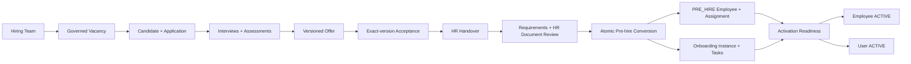

# Unit 3 connected recruitment lifecycle

## Scope and architecture

Unit 3 connects the existing HR organization, authorization, audit, private-storage, notification outbox, employee, position-capacity, and lifecycle engines into one recruitment-to-activation process. The implementation is additive: legacy `Applicant`, `JobApplication`, staged candidate-portal, and `Offer` records remain readable, while new governed records use explicit identifiers, state history, immutable offer versions, and one-to-one conversion constraints.

Every public or administrative command rechecks organization scope and record state on the server. State changes use optimistic versions or unique database keys, append audit evidence, and enqueue external email after recording a durable outbox message. Sensitive documents remain in the existing private-storage architecture and are referenced by opaque IDs.

## Identifiers and idempotency

| Entity | Public identifier | Concurrency mechanism | Duplicate guard |
| --- | --- | --- | --- |
| Vacancy | `VAC-YYYY-######` | organization/year sequence upsert | unique vacancy number |
| Applicant | `APP-YYYY-######` | organization/kind/year sequence upsert | normalized email/phone review |
| Application | `APL-YYYY-######` | organization/kind/year sequence upsert | unique browser submission key |
| Employee | `EMP-YYYY-######` | organization/year employee sequence upsert | unique candidate link and conversion |

Applicant matching only reuses an exact normalized email or phone match. It does not merge uncertain identities. An applicant may own multiple applications. Retried submission, offer acceptance, handover creation, conversion, task generation, outbox delivery, and activation return the existing durable result or are rejected by a unique constraint.

## Controlled workflow

Vacancy and application transition tables are defined in `src/lib/hr/recruitment/states.ts`. The handover path is:

`PENDING_HR_REVIEW → IN_REVIEW → INFORMATION_REQUESTED | RETURNED_TO_HIRING_TEAM | APPROVED → CONVERTED_TO_PRE_HIRE`

Cancellation is terminal. HR approval is blocked while a blocking requirement is incomplete or an HR document review is unresolved.

Offers use immutable `HrRecruitmentOfferVersion` rows. Approval, delivery, acceptance, and decline always reference one exact version. The offer creator cannot approve their own offer. Issuance requires approval of the active version. Acceptance checks status, candidate ownership, exact active version, and expiry inside the transaction; its unique acceptance creates exactly one handover.

Pre-hire conversion requires an approved handover, valid accepted offer, complete blocking requirements, HR-verified documents, an active capacity-bearing position, and an active onboarding template. The transaction creates the PRE_HIRE employee, employee number, assignment, candidate link, onboarding instance/tasks, conversion record, audit event, and final states together. Position reconciliation runs in the same transaction, so capacity failure rolls everything back.

Activation is separate from conversion and checks HR conversion, required onboarding tasks, start time, assignment, hold/cancellation, and MFA when an employee user exists. The authenticated internal worker is idempotent and reports blocked employees without partially activating them.

## Permission matrix

Hiring Team permissions are the intersection of active organization roles and active team membership grants. Principal command permissions include:

| Area | Permissions |
| --- | --- |
| Hiring Teams | `hiring_team.create`, `view`, `update`, `manage_members`, `manage_permissions`, `deactivate` |
| Vacancies | `vacancy.create`, `edit`, `submit`, `approve`, `publish`, `pause`, `close`, `cancel`, `fill`, `reassign` |
| Applications | `application.view`, `review`, `request_information`, `shortlist`, `reject`, `hold` |
| Interviews | `interview.schedule`, `reschedule`, `cancel`, `feedback.submit`, `feedback.view` |
| Offers | `offer.create`, `edit`, `submit`, `approve`, `issue`, `cancel` |
| Handover | `handover.view`, `review`, `request_information`, `return`, `approve`, `cancel` |
| Pre-hire/onboarding | `document.verify`, `employee.prehire.create`, `employee.activate`, `onboarding.view`, `manage`, `complete_task`, `override` |

Pages hide unavailable actions, but services and server actions remain the authority. Interview feedback requires exact panel assignment and prevents editing another interviewer’s submission.

## Audit and notifications

Audit actions use the `hr.recruitment.*` namespace and include organization, actor when known, entity, prior/new state, reason, correlation ID, source, and timestamp. The shared sanitizer redacts salary, bank, identity, token, password, and document-content fields.

Applicant confirmation, Hiring Team review notices, interview invitations, offer issuance, handover changes, conversion, onboarding, and activation use the existing idempotent email outbox and in-app notification tables. Provider failure does not roll back a successful application or state transition. Existing worker retry, delivery-attempt, abandonment, and administrator visibility behavior applies.

## Migration and recovery

Migration `20260731020000_hrms_recruitment_lifecycle` is additive:

- adds nullable recruitment columns to legacy applicant/application tables;
- adds new lifecycle tables, indexes, unique keys, checks, and foreign keys;
- adds `PRE_HIRE`, `READY_FOR_START`, `ON_HOLD`, and `CANCELLED` employee enum values;
- does not delete, rename, fabricate, or rewrite existing recruitment records.

Before applying, create a restorable database backup and run `prisma migrate status`. Validate row counts and null rates before and after. Old applications intentionally remain without fabricated applicant/application numbers; new governed submissions populate them.

Rollback is application-first: redeploy the preceding commit while leaving additive tables in place. This safely restores old behavior without losing newly collected evidence. A destructive schema rollback must only occur after exporting all Unit 3 rows and confirming no employee, application, handover, offer, or audit record depends on them. PostgreSQL enum values are intentionally not removed during emergency rollback.

## Security review

- Public submission is rate limited, validates file type/size through the existing private upload service, and rechecks vacancy state/deadline at commit time.
- Public output uses an explicit safe vacancy projection.
- Admin reads are organization scoped; candidate acceptance requires application ownership.
- Direct links are opaque and authorization is revalidated after authentication.
- Offer salary is excluded from notification payloads and sanitized audit values.
- Unique constraints and optimistic versions protect races.
- No migration or code in this unit reads or changes production directly.

## Monitoring

Alert on outbox abandoned messages, routing queues without active recipients, application submission errors, position-capacity rollbacks, handovers blocked near start date, overdue required onboarding tasks, activation worker authorization failures, and repeated activation blockers. Track p95 submission latency, outbox age, time-to-first-review, offer expiry rate, handover age, onboarding readiness, and start-date activation lag.

## Known operational requirements

- Configure at least one active onboarding template before conversion.
- Configure blocking requirement definitions before initializing a handover.
- Run the activation endpoint with `Authorization: Bearer $ORGANIZATION_WORKER_SECRET`; the secret must meet the existing 64-character policy.
- Apply and test the migration in an isolated staging database before production.
- Real database concurrency, private object storage, mail delivery, browser E2E, load, backup restore, and worker-restart tests require the staging infrastructure and are not represented by local unit tests alone.
